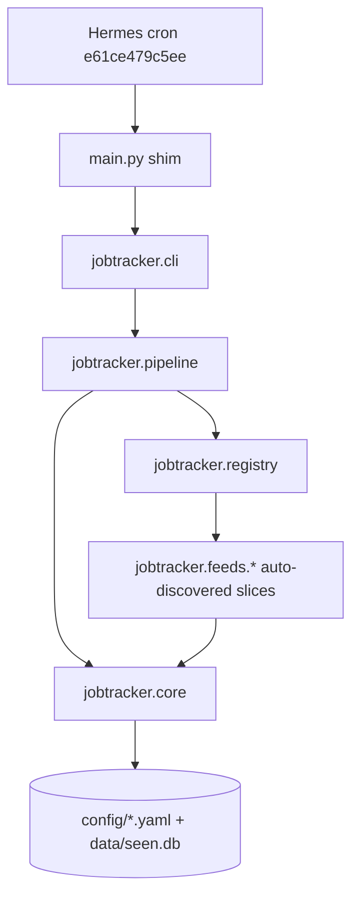

# Vertical Slicing Architecture Design

**Spec**: `.specs/features/vertical-slicing/spec.md`
**Status**: Approved (direction pre-approved by Otavio: vertical feature slicing, poetry, extensibility for new feeds)

---

## Architecture Overview

Replace the technical-layer layout (`src/scrapers|filters|store|output`) with a **vertical feature slicing** layout: every job feed is a self-contained slice owning fetch + parse + registration, sitting on a small shared core (scoring, dedup, digest, config). A decorator registry with package auto-discovery removes the if/elif dispatcher: adding a feed = dropping one module into `src/jobtracker/feeds/` + one `sources.yaml` entry. Nothing else changes.



Dependency rule (one-way, enforced by import-lint test):

```
main.py → cli → pipeline → registry → feeds → core
                 └───────────────────────────↗
```

- `core` imports nothing from `feeds`, `registry`, `pipeline`, or `cli`
- `feeds` may import `core` (config loader) and `registry` (decorator) - nothing else in the package
- `registry` never imports `feeds` (registration flows through the decorator; `feeds/__init__` drives discovery)

### Target layout

```
job-tracker/
├── ARCH.md                    # architecture doc of record (replaces wiki section)
├── README.md                  # quick start, feeds table, cron setup → links ARCH.md
├── pyproject.toml             # poetry: pyyaml (runtime), pytest (dev), packages from src/
├── poetry.lock                # committed
├── main.py                    # thin shim: sys.path bootstrap + cli.main()  [CRON CONTRACT]
├── config/
│   ├── sources.yaml           # unchanged: feed registry input
│   └── criteria.yaml          # unchanged: profile weights
├── data/                      # seen.db (gitignored; JOBTRACKER_DATA_DIR overrides)
└── src/jobtracker/
    ├── __init__.py
    ├── cli.py                 # argparse (--reset/--source/--dry-run) + main()
    ├── pipeline.py            # orchestration: load sources → scrape → score → dedup → digest → mark seen
    ├── registry.py            # @register(type) decorator, type→fn map, scrape_source(source)
    ├── core/
    │   ├── __init__.py
    │   ├── config.py          # repo_root(), load_sources(), load_criteria() (merges old filters/criteria.py)
    │   ├── scoring.py         # verbatim filters/matcher.py, criteria via core.config
    │   ├── seen.py            # verbatim store/seen.py + JOBTRACKER_DATA_DIR support
    │   └── digest.py          # verbatim output/digest.py
    └── feeds/                 # VERTICAL SLICES
        ├── __init__.py        # pkgutil.iter_modules auto-import (discovery)
        ├── greenhouse.py      # each module: fetch + parse + @register("type")
        ├── hackernews.py
        ├── infranyc.py
        ├── report.py          # manual-review pseudo-feed
        ├── speedrun.py
        ├── substack.py
        └── ycombinator.py     # enrichment keywords via core.config.load_criteria()
```

---

## Code Reuse Analysis

### Existing Components to Leverage

| Component | Location | How to Use |
| -------------------- | ---------------------- | ---------------------------------------------------- |
| Scraper logic (all 6 feeds) | `src/scrapers/*.py` | Move near-verbatim into `feeds/*.py`; only signature changes to `scrape(source: dict)` |
| Matcher | `src/filters/matcher.py` | Move verbatim to `core/scoring.py` (import of criteria loader redirected) |
| Criteria loader | `src/filters/criteria.py` | Merged into `core/config.py` as `load_criteria()` |
| Dedup store | `src/store/seen.py` | Move verbatim to `core/seen.py` + env-overridable data dir |
| Digest formatter | `src/output/digest.py` | Move verbatim to `core/digest.py` |
| Pipeline `run()` | `main.py:59-126` | Move verbatim to `pipeline.py`; dispatch call swapped to `registry.scrape_source` |
| Argparse block | `main.py:129-136` | Move verbatim to `cli.py` |
| Golden stdout | captured pre-refactor (`--source ramp --dry-run`) | Embedded as expected string in the CLI contract test |

### Integration Points

| System | Integration Method |
| -------------- | ------------------------------------------------------- |
| Hermes cron `e61ce479c5ee` | Runs `cd ~/code/job-tracker && /usr/bin/python3 main.py 2>/dev/null`; main.py stays at repo root, stdout text byte-compatible, no install required |
| `config/sources.yaml` | `type` field = registry key; `config` dict passed through to the feed verbatim |
| `config/criteria.yaml` | Single loader in `core/config.py`; also used by ycombinator enrichment |
| `data/seen.db` | Same SQLite schema/location by default; `JOBTRACKER_DATA_DIR` for test isolation |

---

## Components

### jobtracker.registry

- **Purpose**: Feed registry: maps `sources.yaml` `type` → scrape function; the extension point.
- **Location**: `src/jobtracker/registry.py`
- **Interfaces**:
  - `register(feed_type: str)` - decorator storing the function under `_REGISTRY[feed_type]`
  - `get(feed_type: str) -> Callable | None` - lookup
  - `registered_types() -> list[str]` - sorted keys (for tests/debug)
  - `scrape_source(source: dict) -> list[dict]` - dispatch; unknown type prints `  Unknown source type: <type>` and returns `[]`
- **Dependencies**: stdlib only; never imports `feeds`
- **Reuses**: the elif-chain semantics of `main.py::scrape_source`

### jobtracker.feeds (package + slices)

- **Purpose**: One vertical slice per feed type. Each module owns fetching, parsing, and its `@register` declaration.
- **Location**: `src/jobtracker/feeds/`
- **Interfaces** (per slice): `scrape(source: dict) -> list[dict]` where `source` is the full YAML entry (`name`, `type`, `url`, `config`). Returns standardized dicts `{title, company, url, location, description, source}`; prints `  [<feed>:<id>] Error: ...` and returns `[]` on failure; never raises.
- **Dependencies**: stdlib (`urllib`, `json`, `re`, `xml`), `jobtracker.registry.register`, and (ycombinator only) `core.config.load_criteria`
- **Reuses**: existing scraper module bodies moved with minimal edits

### jobtracker.core (shared kernel)

- **Purpose**: Cross-slice domain logic: profile scoring, dedup state, digest rendering, config loading.
- **Location**: `src/jobtracker/core/`
- **Interfaces**:
  - `config.repo_root() -> Path`, `config.load_sources() -> list[dict]`, `config.load_criteria() -> dict`
  - `scoring.score_listing / should_reject / filter_and_score` (verbatim matcher API)
  - `seen.is_seen / mark_seen / filter_unseen / mark_all_seen / clear_all` (verbatim store API)
  - `digest.format_digest(listings) -> str`
- **Dependencies**: stdlib + PyYAML; never imports feeds/registry/pipeline
- **Reuses**: existing layer modules moved

### jobtracker.pipeline + cli + main.py

- **Purpose**: Orchestration and the frozen CLI contract.
- **Location**: `src/jobtracker/pipeline.py`, `src/jobtracker/cli.py`, `main.py`
- **Interfaces**: `pipeline.run(reset=False, source_filter="", dry_run=False) -> str | None`; `cli.main()`; `main.py` = docstring + sys.path bootstrap + `main()`
- **Dependencies**: imports core + registry (and thereby feeds via discovery)
- **Reuses**: verbatim `run()` body and argparse block from today's `main.py`

---

## Data Models (if applicable)

### Listing (plain dict, contract unchanged)

```python
{
  "title": str, "company": str, "url": str, "location": str,
  "description": str,        # feeds synthesize text so the matcher can score it
  "source": str,             # sources.yaml name
  # added by scoring: "score": int, "tier": "strong|worth|weak|rejected",
  #                   "matched_signals": list[str], "reject_reason": str
}
```

**Relationships**: produced by feeds → enriched by `core.scoring` → filtered by `core.seen` → rendered by `core.digest`. No dataclass migration (churn avoidance; contract documented here and in ARCH.md).

---

## Error Handling Strategy

| Error Scenario | Handling | User Impact |
| -------------- | ------------------------------------------------------- | ---------------------------------------- |
| Feed scrape raises (network, parse) | Feed-level try/except: print `  [<feed>:<id>] Error: ...`, return `[]`; pipeline continues | Digest omits that source; others unaffected |
| Unknown source type in sources.yaml | `registry.scrape_source` prints `  Unknown source type: <type>`, returns `[]` | Same message as current elif `else` branch |
| Missing YAML config file | Python FileNotFoundError propagates (unchanged behavior) | Clear crash; cron stays silent |
| Listing with empty URL | Dedup hashes the empty string (unchanged) | Same dedup semantics as today |

---

## Risks & Concerns

| Concern | Location (file:line) | Impact | Mitigation |
| ------- | -------------------- | ------ | ---------- |
| Cron stdout regression silently kills digest delivery | `main.py` whole file | Digest never reaches Telegram | Golden byte-match test on `--source ramp --dry-run` output + flag parity test; refactor prints verbatim |
| Tests could wipe production dedup state | `src/store/seen.py:6` module-level DB path | Irreversible loss of seen history | `JOBTRACKER_DATA_DIR` env override resolved at call time; every store test sets it to `tmp_path`; import-lint + code review |
| Registry/feeds circular import | design risk | ImportError at startup | Decorator lives in `registry` (imports nothing from feeds); `feeds/__init__` does discovery; `pipeline` imports `feeds` before dispatching |
| ycombinator duplicates criteria loading | `src/scrapers/ycombinator.py:43-52` | Two YAML readers drift | Redirected to `core.config.load_criteria()` with the same exception fallback defaults |
| Poetry env drift vs system python used by cron | runtime env | Tests green in venv, cron breaks under 3.12 system | Runtime deps = stdlib + PyYAML only (already present for `/usr/bin/python3`); smoke contract test runs `main.py` via subprocess and byte-compares |

---

## Tech Decisions (only non-obvious ones)

| Decision | Choice | Rationale |
| ----------------- | ------------------------- | --------------------------------------------------------- |
| Slicing strategy | Full vertical slices (feed = fetch+parse+register in one module), not thin adapters over a shared http helper | A new feed source often needs bespoke transport quirks (Inertia payloads, RSC streams, UA headers); self-contained slices make those changes local |
| Registry discovery | `pkgutil.iter_modules` inside `feeds/__init__.py` | Zero-touch: new module file registers itself on first import; no list to maintain |
| Listing model | Plain dicts (no dataclass) | Minimal churn, verbatim scraper moves; contract documented in ARCH.md |
| Config loaders | Single `core/config.py` with `repo_root()` path resolution | One place resolves repo layout; feeds/core/pipeline all route through it |
| Test isolation | `JOBTRACKER_DATA_DIR` env var read at call time in `core/seen.py` | Keeps call sites unchanged while making every store test hermetic |
| Packaging layout | `src/jobtracker` package + root `main.py` shim (no console-script entrypoint dependency) | Cron runs the file directly with system python; shim bootstrap makes both worlds work |
| Worktree | Branch `refactor/vertical-slicing` in `~/code/job-tracker-arch` | Standing rule for cron-driven repos; merge on explicit go-ahead |

> **Project-level decisions:** recorded in `.specs/STATE.md` as AD-0001..AD-0004.
